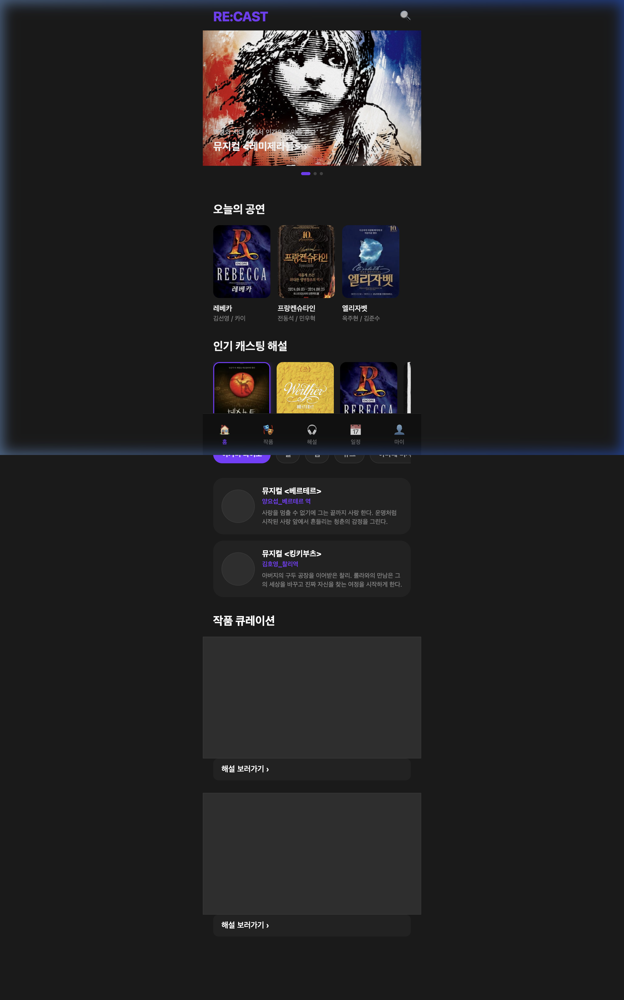

# Re:Cast Home Screen Redesign Walkthrough

The Re:Cast home screen has been fully rebuilt according to the new wireframe, featuring a premium dark theme, interactive sliders, and dynamic content.

## Key Features Implemented

### 1. Interactive Banner Slider
- **Swipe Support**: Enabled smooth horizontal swiping with CSS `scroll-snap`.
- **Dot Navigation**: Tapping the dots at the bottom of the banner scrolls to the corresponding image.
- **Auto-Sync**: Dots automatically update their active state as you swipe through the banner.

### 2. 오늘의 공연 (Today's Performance)
- Displays three performance cards with large (110x140) posters.
- Includes show titles and cast names in a horizontal scrollable row.

### 3. 인기 캐스팅 해설 (Popularity Insights)
- **Horizontal Slider**: Posters can be swiped with snapping behavior.
- **Dynamic Character Roles**: Clicking a musical poster (e.g., Death Note, Beetlejuice) updates the character roles below uniquely for that show.
- **Interactive Capsules**: Tapping a character role capsule toggles its selection (purple highlight).

### 4. 작품 큐레이션 (Work Curation)
- Two large vertical content frames (390x234) for highlighted works.
- Each followed by a stylized "해설 보러가기 ›" button.

## Visual Enhancements
- **Consistent Dimensions**: 
  - Banner: 420x260
  - Posters: 110x140
  - Buttons: 390x42
- **Dark Theme**: Glassmorphism effects, subtle borders, and a deep purple accent color (#7a3cff) for active states.
