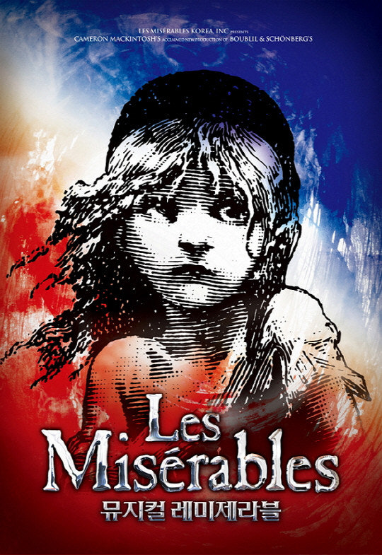
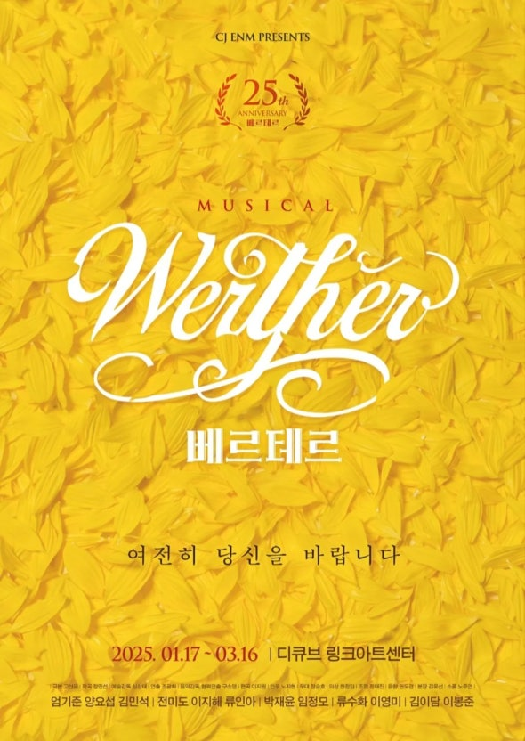
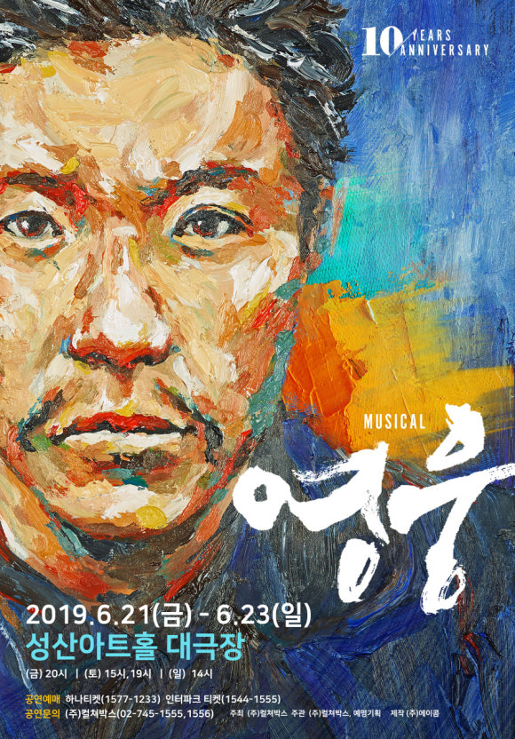

<!doctype html>
<html lang="ko">
  <head>
    <meta charset="UTF-8" />
    <meta name="viewport" content="width=device-width, initial-scale=1.0" />
    <title>Re:Cast</title>
    <link rel="stylesheet" href="styles.css" />
  </head>
  <body>
    

      <header class="header">
        <h1 class="header__logo">Re:Cast</h1>
        <button class="header__search-btn">🔍</button>
      </header>

      <main class="content">
        <section class="home">

          <!-- 오늘의 공연 배너 -->
          <h2 class="section-title">오늘의 공연</h2>
          
          

            

              
              

                인기
                <h3>레미제라블</h3>
              

            

            

              
              

                추천
                <h3>킹카부츠</h3>
              

            

            

              
              

                NEW
                <h3>베르테르</h3>
              

            

            

              
              

                HOT
                <h3>영웅</h3>
              

            

          

          <!-- 찜한 배우 -->
          <h2 class="section-title">찜한 배우</h2>
          

            

              
              
양요섭

            

            

              
              
최수진

            

            

              
              
이한율

            

            

              
              
홍나현

            

          

          <!-- 오늘의 도슨트 -->
          <h2 class="section-title">오늘의 도슨트</h2>
          

            <h3>뮤지컬 &lt;레미제라블&gt; 해설</h3>
            

              혁명은 거창한 구호에서 시작되지 않습니다. 
              한 사람의 선택과 양심에서 시작됩니다. 
              오늘 공연에서는 장발장의 인간적인 갈등과 
              자베르의 신념 충돌에 집중해 보세요.
            

          

          

            <h3>오늘의 관람 포인트</h3>
            <ul>
              <li>장발장의 독백 넘버 "Who Am I?"</li>
              <li>바리케이드 장면 속 청년들의 이상</li>
              <li>자베르의 신념이 흔들리는 순간</li>
            </ul>
          

          <!-- 뮤지컬 슬라이드 -->
          <h2 class="section-title">뮤지컬 둘러보기</h2>
          

            

              
              
레미제라블

            

            

              
              
킹카부츠

            

            

              
              
베르테르

            

            

              
              
영웅

            

          

          <!-- 인기 캐스팅 해석 -->
          <h2 class="section-title">인기 캐스팅 해석</h2>
          

            <h3>양요섭 캐스팅</h3>
            
#애절함 #첫사랑

            

              양요섭의 베르테르는 감정을 크게 드러내기보다 
              마음속에서 천천히 무너지는 인물을 보여준다. 
              첫사랑의 기억처럼 조용히 스며드는 감정이 특징이다.
            

          

          

            <h3>김호영 캐스팅</h3>
            
#에너지 #유쾌한남자

            

              김호영의 롤라는 화려한 카리스마와 유쾌함을 동시에 지닌다. 
              무대 위에서 그는 자신을 사랑하는 용기를 보여준다.
            

          

          <!-- 최근 관람 기록 (Merged from remote) -->
          <h2 class="section-title">최근 관람 기록</h2>
          

            

              

              

                
지킬앤하이드

                
26.03.05 | 조승우 캐스트

              

            

          

        </section>
        </section>
      </main>

      <nav class="nav-bar">
        
🏠 Home

        
📖 Guide

        
🔴 Record

        
⚖️ Compare

        
👤 My

      </nav>
    

  </body>
</html>
